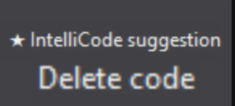
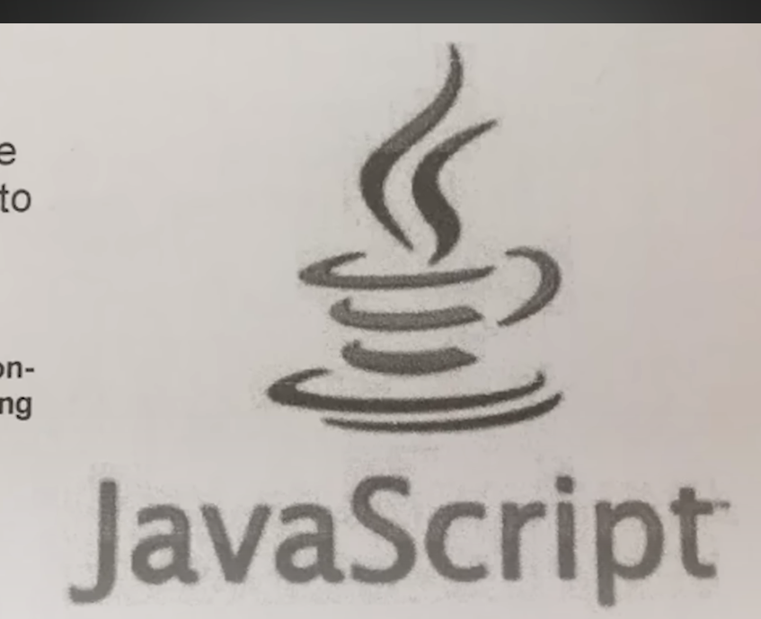

# DO NOT USE THE RELEASES I HAVENT TESTED IT YET AND IT LOOKS LIKE THERES SOME MORE SERVER-SIDE CHECKS OR SMTH

rules are meant to be broken XD

build instruction:

open solution EOSCLient.sln, not ExamClient.sln

press build (F6)

press run or debug, depends on ya

bye imna kms

PS: pls dont pollute the main branch

i wont fix the consequences

